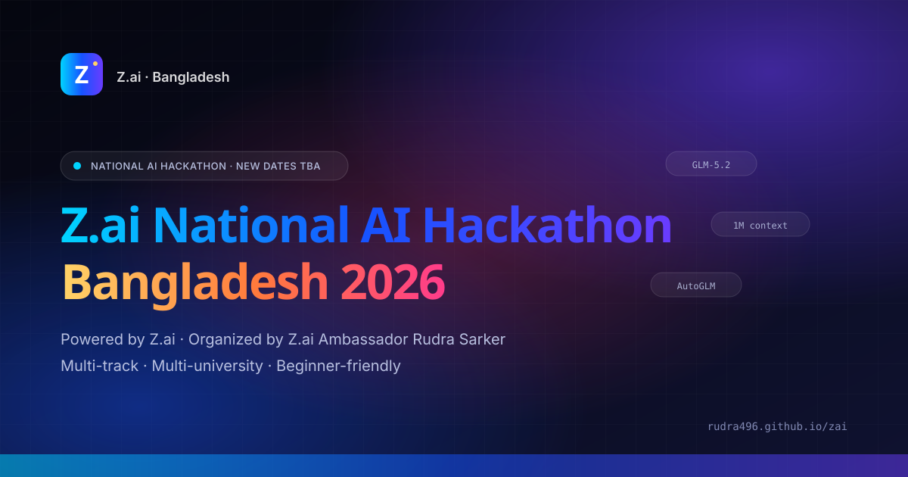

# Z.ai National AI Hackathon — Bangladesh 2026

> The first Z.ai-powered **national** AI hackathon for Bangladesh. **September 2026.** Multi-track, multi-university, beginner-friendly. Powered by **Z.ai**. Organized by **Rudra Sarker**, Z.ai Ambassador for Bangladesh.

<p align="center">
  
</p>

<p align="center">
  
  
  
  
  
</p>

---

## Overview

**Z.ai National AI Hackathon — Bangladesh 2026** is the first national-scope student AI hackathon in Bangladesh built entirely on Z.ai's GLM model family (GLM-5 → GLM-5.1 → GLM-5 Turbo → GLM-5V Turbo → GLM-5.2) and Z.ai's developer tools (AutoGLM, AutoClaw, ZCode).

It is organized by **Rudra Sarker** ([Z.ai Ambassador for Bangladesh](https://www.linkedin.com/in/rudrasarker)) together with **RoboSUST Club** and partner universities across the country.

The hackathon runs as an online qualifier feeding into an in-person national final at **Shahjalal University of Science and Technology (SUST), Sylhet**, with satellite hubs in **Dhaka**, **Chattogram**, and **Rajshahi**.

---

## September 2026 timeline

| Phase | Dates | What happens |
|---|---|---|
| 01 — Registration | **Sep 1–7, 2026** | Nationwide call for teams |
| 02 — Workshops | **Sep 8–14, 2026** | Virtual Z.ai onboarding + GLM crash course |
| 03 — Online qualifier | **Sep 15–21, 2026** | Prototype + 3-min demo video submission |
| 04 — In-person final | **Sep 26–27, 2026** | Two-day build + demo + judging at SUST, Sylhet |
| 05 — Showcase | **Sep 30, 2026 →** | Open-source publication + media showcase |

---

## Why this event, why now

Bangladesh has one of the largest student developer populations in South Asia, but until now it has had **no national AI hackathon anchored on a single frontier platform** with on-the-ground ambassador support. This event fills that gap.

- **5 impact tracks:** Education · Healthcare · Inclusion · Climate · Campus Life
- **Beginner-friendly:** no prior AI/ML experience required; starter kits and workshops provided
- **Free for all enrolled students**
- **Real Z.ai adoption:** every project must meaningfully use Z.ai's GLM API

---

## Website (premium build v2)

The website is a static, GitHub Pages-friendly site built with hand-crafted HTML, CSS, and vanilla JavaScript. No build step, no framework, no lock-in.

```
index.html      ← landing page (hero, tracks, timeline, FAQ, register, etc.)
styles.css      ← full premium design system (dark, aurora, glassmorphism, animations)
app.js          ← scroll progress, mobile nav, 3D card tilt, animated counters,
                  IntersectionObserver reveals, custom cursor glow, FAQ single-open
assets/         ← favicon + Open Graph cover (SVG)
```

### Premium features

- **Aurora gradient hero** with floating brand badges (GLM-5.2, AutoGLM, AutoClaw, ZCode, 1M context)
- **3D card tilt** with cursor-following glow on hover
- **Animated counters** in hero stats and Why-Bangladesh section
- **Scroll progress bar** at top of page
- **Reveal-on-scroll** animations (with staggered delays)
- **Active nav-link highlighting** via IntersectionObserver
- **Custom cursor glow** (desktop only, respects reduced-motion)
- **Marquee** of impact tracks
- **Glassmorphic** nav with blur + scroll-aware background
- **Back-to-top** floating button
- **Animated gradient text** for emphasis words
- **Single-open FAQ** accordion
- **Full reduced-motion + print support**

### Run locally

```bash
# Python 3
cd zai
python -m http.server 8080
# Open http://localhost:8080
```

Or just open `index.html` in your browser.

### Deploy

GitHub Pages-friendly. After pushing to `github.com/rudra496/zai` and enabling Pages on the `main` branch root, the site is live at:

```
https://rudra496.github.io/zai/
```

---

## SEO + accessibility

- Full Open Graph + Twitter Card meta (premium SVG cover)
- JSON-LD Event structured data with VirtualLocation + physical venue
- Semantic HTML landmarks (`header`, `main`, `section`, `footer`)
- Skip-to-main-content link
- `focus-visible` styles for keyboard navigation
- Mobile hamburger menu + responsive breakpoints down to 360px
- Print-friendly styles
- `prefers-reduced-motion` support throughout

---

## Origin

This national-scope event is the public evolution of the SUST-only [`glm-hackathon-2026`](https://github.com/rudra496/glm-hackathon-2026) repo. That repo remains the operational template for the in-person finals; this repo (`zai`) is the public-facing, sponsor-ready, nation-wide face of the event.

---

## Contact

- **Ambassador:** Rudra Sarker — Z.ai Ambassador, Bangladesh
- **Email:** rudrasarker130@gmail.com
- **LinkedIn:** https://www.linkedin.com/in/rudrasarker
- **X:** https://x.com/Rudra496
- **GitHub:** https://github.com/rudra496
- **Portfolio:** https://rudra496.github.io/site/

---

## License

MIT © 2026 Rudra Sarker. Z.ai and GLM are products of Zhipu AI. This repository is an ambassador-organized community event and is not an official Z.ai product.
